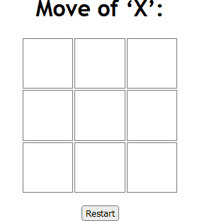

# Tic-tac-toe

Simple web browser Tic-tac-toe game based on Scotty library.

## Dependencies
* [GHC, cabal](https://www.haskell.org/ghcup/) – compiler and package manager
* [Matrix](https://hackage.haskell.org/package/matrix) – storing and manipulating board data
* [Scotty](https://hackage.haskell.org/package/scotty) – back-end web engine
* [Blaze.Html](https://hackage.haskell.org/package/blaze-html) – writing HTML templates
* [Wai.Middleware.Static](https://hackage.haskell.org/package/wai-middleware-static) – applying CSS and attaching favicon


## Usage

Setup your Haskell environment (e. g. using [GHCup](https://www.haskell.org/ghcup/)):

* cabal 3.10.2.1+
* GHC 9.4.8+ (base ^>=4.17.2.1)

Next clone this repository, run the application

```shell
$ git clone https://github.com/NSUSpray/tic-tac-toe
$ cd tic-tac-toe
$ cabal run
```

and wait for the message

```
Setting phasers to stun... (port 3000) (ctrl-c to quit)
```

Then open your browser and enter in the address bar http://localhost:3000/


## Test

Execute in your shell

```shell
$ cabal test --test-show-details=direct
```

or

```shell
$ cabal run tic-tac-toe-test
```

*--test-show-details=direct* means that test case results will be sent in real time; no log file.
